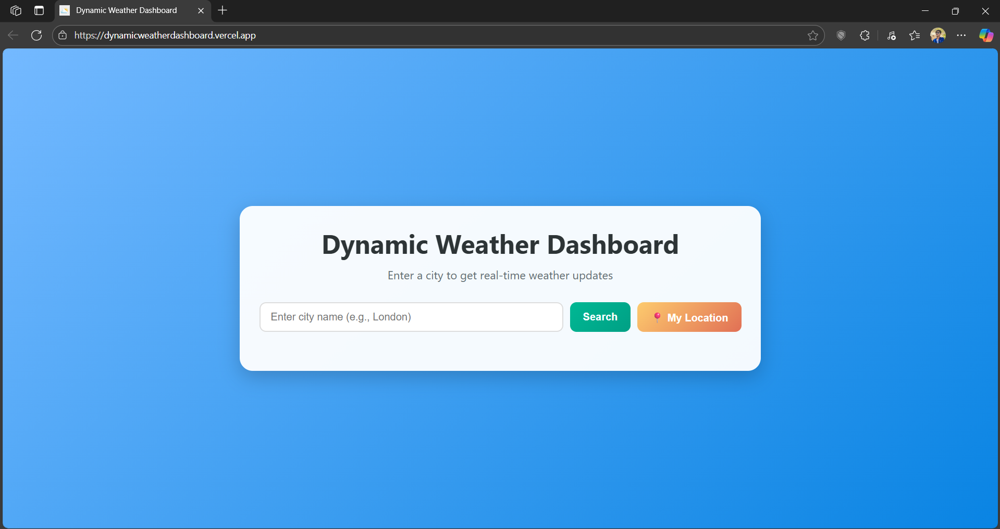

# 🌦️ Dynamic Weather Dashboard

A clean, responsive, and user-friendly web application that provides **real-time weather data** for any city in the world. Users can also fetch weather information for their **current location** with one click.

This project is built with **vanilla HTML, CSS, and JavaScript**, and uses a **secure Vercel serverless function** to protect the OpenWeatherMap API key.

🔗 **Live Demo:** [Dynamic Weather Dashboard](https://dynamicweatherdashboard.vercel.app/)

---

## ✨ Features

- **Search by City:** Enter any city name to get current weather data.
- **Geolocation Support:** Use the "My Location" button to fetch weather based on your current position.
- **Secure API Calls:** API requests are proxied through a Vercel Serverless Function to keep your API key safe.
- **Weather Details Display:**
  - 🌡️ Temperature (°C)
  - 🌥️ Weather description (e.g., "clear sky", "light rain")
  - 💧 Humidity (%)
  - 💨 Wind speed (m/s)
- **Dynamic Icons:** Weather icons update dynamically according to conditions.
- **User-Friendly Interface:**
  - Clear loading and error states
  - Responsive design for desktop & mobile

---

## 🖼️ Screenshot



---

## 🛠️ Tech Stack

**Front-End:**
- HTML5
- CSS3 (Flexbox/Grid + responsive design)
- Vanilla JavaScript (ES6+)

**Back-End:**
- Vercel Serverless Function (Node.js) to handle API requests securely

**API:**
- OpenWeatherMap API

**Deployment:**
- Vercel & Git

---

## ⚙️ How It Works

1. **Front-End (script.js):** Captures user input (city name or geolocation).  
2. **API Request:** Instead of calling OpenWeatherMap directly, it fetches data from the custom serverless endpoint `/api/weather`.  
3. **Serverless Function (api/weather.js):**
   - Retrieves the API key from environment variables on Vercel
   - Sends request to OpenWeatherMap API
   - Returns the result securely  
4. **Response Handling:** Data is displayed dynamically in the UI (temperature, humidity, etc.)  

This ensures the **API key is never exposed** to the browser.

---

## 🚀 Setup & Deployment

### 1. Prerequisites
- [Node.js](https://nodejs.org/) (LTS recommended)
- [Git](https://git-scm.com/)
- [Vercel Account](https://vercel.com/)
- [OpenWeatherMap API Key](https://openweathermap.org/)

### 2. Clone the Repository
```bash
git clone https://github.com/your-username/weather-dashboard.git
cd weather-dashboard
```

### 3. Install Vercel CLI
```bash
npm install -g vercel
```

### 4. Create `.env` File (Local Dev)
```env
API_KEY="YOUR_OPENWEATHERMAP_API_KEY"
```

### 5. Run Locally
```bash
vercel dev
```
Open: `http://localhost:3000`

### 6. Deploy on Vercel
1. Push to GitHub:
```bash
git add .
git commit -m "Initial commit"
git push origin main
```
2. Go to [Vercel Dashboard](https://vercel.com/) → "New Project" → Import Repo  
3. Add Environment Variable:
   - Name: `API_KEY`
   - Value: Your OpenWeatherMap API key  
4. Click **Deploy** 🚀

---

## 📂 File Structure
```
.
├── index.html       # Main HTML structure
├── style.css        # Styling and responsiveness
├── script.js        # Weather logic & DOM handling
└── api
    └── weather.js   # Vercel Serverless Function
```

---

## 📜 License

This project is **MIT Licensed** – free to use and modify.
