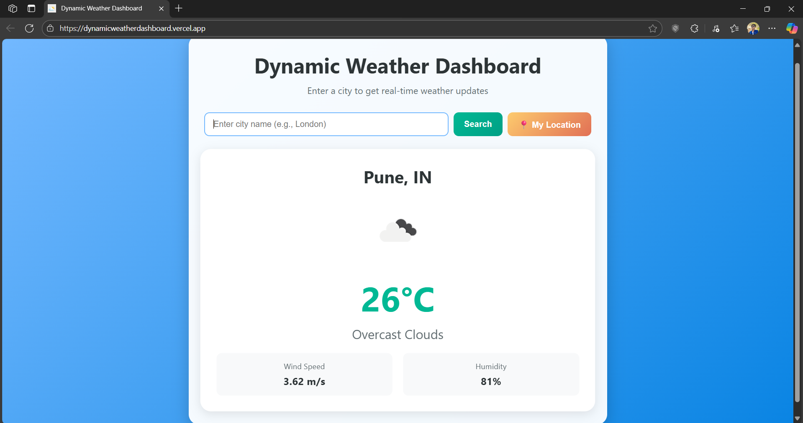

# Dynamic Weather Dashboard

A **clean, responsive, and user-friendly** web application that provides **real-time weather data** for any city in the world. Users can also fetch weather information for their **current location with a single click**. This project is built with **vanilla HTML, CSS, and JavaScript**, leveraging the **OpenWeatherMap API** for data.

---

## Features

- **Search by City**: Get the current weather for any city by typing its name in the search bar.
- **Geolocation**: Use the "My Location" button to automatically fetch weather data for your current position.
- **Detailed Information**: Displays key weather metrics:
  - Temperature (in Celsius)
  - Weather description (e.g., "clear sky", "light rain")
  - Humidity percentage
  - Wind speed (in m/s)
- **Dynamic Icons**: Weather icons update automatically to reflect the current conditions.
- **User-Friendly Interface**:
  - Clear loading and error states for better user feedback
  - Modern, clean UI with responsive design for **desktop and mobile**
- **Efficient API Calls**: Uses modern JavaScript (**Async/Await** and **Fetch API**) for efficient and non-blocking requests.

---

## Screenshot
*(Replace this with your own screenshot)*



---

## Technologies Used

| Technology            | Purpose                                                                 |
|-----------------------|-------------------------------------------------------------------------|
| HTML5                 | Structure and content of the application                                |
| CSS3                  | Styling, layout (Flexbox/Grid), animations                               |
| JavaScript (ES6+)     | Application logic, DOM manipulation, API interaction                    |
| OpenWeatherMap API    | Provides real-time weather data                                         |

---

## Setup and Installation

1. **Clone the repository**
```bash
git clone https://github.com/your-username/weather-dashboard.git
```
*(If you don’t have a repository, just download the files into a single folder.)*

2. **Navigate to the project directory**
```bash
cd weather-dashboard
```

3. **Get an API Key**
- Go to [OpenWeatherMap](https://openweathermap.org/) and create a free account.
- Navigate to the **API keys** tab and copy your default API key.

4. **Add the API Key to the project**
- Open the `script.js` file.
- Find the following line at the top:
```javascript
const API_KEY = 'YOUR_API_KEY_HERE'; // Replace with your OpenWeatherMap API key
```
- Replace `'YOUR_API_KEY_HERE'` with your own API key.

5. **Run the application**
- Simply open `index.html` in your favorite web browser.

---

## How It Works

1. **Initialization**:  
   - The script gets references to all necessary DOM elements (input fields, buttons, display areas).

2. **Event Listeners**:  
   - **Search Button**: Fetches weather data using the city name from the input field.
   - **Enter Key**: Pressing "Enter" triggers a search.
   - **Geolocation Button**: Uses the browser’s `navigator.geolocation` API to get the user's latitude and longitude.

3. **API Communication (`fetchWeather` function)**:  
   - Builds the API URL based on the city name or coordinates.
   - Uses the `fetch()` API to retrieve data from OpenWeatherMap.
   - Handles potential errors (e.g., city not found or network issues).

4. **Displaying Data (`displayWeather` function)**:  
   - Populates HTML elements with relevant data (city name, temperature, icon, etc.).
   - Ensures the weather card is visible to the user.

5. **UI State Management**:  
   - Helper functions (`showLoading`, `hideLoading`, `showError`, `hideError`, `showWeather`, `hideWeather`) manage visibility and provide smooth feedback during API calls.

---

## File Structure
```
.
├── index.html       # Main HTML file (structure)
├── style.css        # CSS file (styling and responsive design)
└── script.js        # JavaScript file (application logic)
```

---

## License
This project is **open-source** and available under the **MIT License**.

